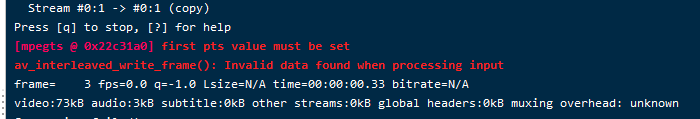

# GoEasyFfmpeg 管理 ffmpeg 命令

根据开源项目[https://github.com/EasyDarwin/EasyDarwin](https://github.com/EasyDarwin/EasyDarwin) 修改而来

### 主要功能特点
- 管理 ffmpeg 推流的项目，支持 rtmp ,rtsp ,flv ,hls 等方式推流
- 推荐使用 [livego](https://github.com/gwuhaolin/livego/blob/master/README_cn.md) 项目做转发服务器
- 也可以使用 [https://github.com/aler9/rtsp-simple-server](https://github.com/aler9/rtsp-simple-server) 
- 也可以自行使用 nginx + nginx-rtmp 搭建服务器

### 目前存在问题 

- windows 下无法停止 

// 停止代码 windows 下不兼容
```go
cmd := pusher2FfmpegMap[pusher]
proc := cmd.Process
if proc != nil {
    logger.Printf("prepare to SIGTERM to process:%v", proc)
    proc.Signal(syscall.SIGTERM)
    proc.Wait()

    logger.Printf("process:%v terminate.", proc)
}
delete(pusher2FfmpegMap, pusher)
logger.Printf("delete ffmpeg from pull stream from pusher[%v]", pusher)
```

### 推流 itpv 的时候各种问题总结

- 最开始直接使用 [https://github.com/EasyDarwin/EasyDarwin](https://github.com/EasyDarwin/EasyDarwin) ,使用了公司的一个摄像头的数据和网上养鸡场[rtsp://www.mym9.com/101065?from=2019-06-28/01:12:13](rtsp://www.mym9.com/101065?from=2019-06-28/01:12:13)推流,
都能正常推流，但是使用电信数据推流的时候会出现 302 的错误，原因是：电信的地址发起 DESCRIB 之后重定向了一次地址， 需要获取新的地址重新发起请求。但这个项目没有处理这个情况，获取到302就直接报错了。
修改了此问题之后，电信地址的 sdp 请求都能通过但是此项目的 rtsp 服务仍然无法启动：此问题未解决。

- 重新梳理了一下需求，采用了其他的推流服务器前面介绍的 [livego](https://github.com/gwuhaolin/livego/blob/master/README_cn.md) 和 [https://github.com/aler9/rtsp-simple-server](https://github.com/aler9/rtsp-simple-server) ，
修改 [https://github.com/EasyDarwin/EasyDarwin](https://github.com/EasyDarwin/EasyDarwin) 项目只用于管理 ffmpeg 命令，启动和停止推流动作。
- 然后使用 [livego](https://github.com/gwuhaolin/livego/blob/master/README_cn.md) 和 [https://github.com/aler9/rtsp-simple-server](https://github.com/aler9/rtsp-simple-server) 项目做推流的时候，出现 cpu 占用太高的问题。
原因是 ffmpeg 推流如果转码的话需要大量的计算。如果同时推流两路信号基本就 80% 了不能满足需求。既然是转码的问题那么就不转码呗。设置 -c:v copy -c:a copy ,结果发现 rtmp 服务器不支持电信的音视频格式。
最后只能换成 [https://github.com/aler9/rtsp-simple-server](https://github.com/aler9/rtsp-simple-server) 服务了，解决了音视频格式不支持问题。

- 有些推流资源会报错 first pts value must be set


解决方式是增加 `-fflags +genpts`

- 关于 FFmpeg 合并 HLS/m3u8 流 TS 切片时出现 Non-monotonous DTS in output stream 的问题
[使用＃EXT-X-DISCONTINUITY-SEQUENCE下载ts流ffmpeg](https://stackoverflow.com/questions/49289394/downloading-ts-stream-with-ext-x-discontinuity-sequence-ffmpeg)

[Trim video and concatenate using ffmpeg - getting “Non-monotonous DTS in output stream” errors](https://superuser.com/questions/1150276/trim-video-and-concatenate-using-ffmpeg-getting-non-monotonous-dts-in-output)

[https://trac.ffmpeg.org/wiki/Concatenate](https://trac.ffmpeg.org/wiki/Concatenate)